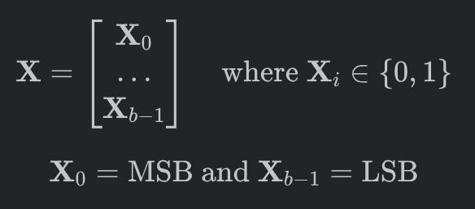
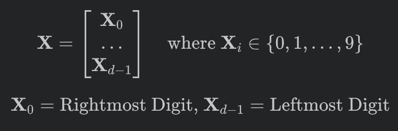
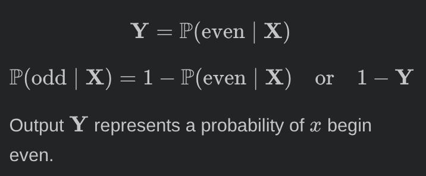
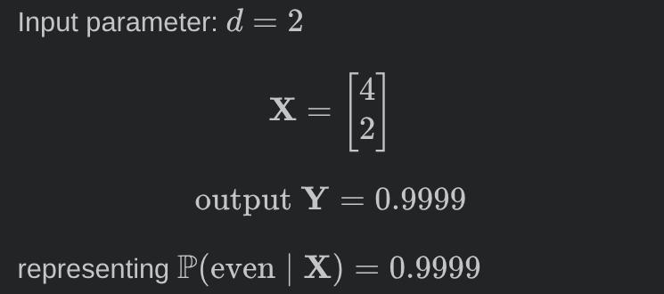

# Even Number Odd Number

An interactive program that uses Statistical Learning Model to predict wheather the given number is even or odd.

## Models
- ### base2 model (Binary System)
Each variable of $\mathbf X$ (input) represents each bit of given input number ($x$)

<!-- $$
\mathbf X = \begin{bmatrix}\mathbf{X}_0\\ \ldots \\\mathbf{X}_{b - 1}\end{bmatrix} \quad \text{where } \mathbf X_i \in \{0, 1\}
$$
$$
\mathbf X_0 = \text{MSB and } \mathbf X_{b - 1} = \text{LSB}
$$ -->

- ### base10 model
Each variable of $\mathbf X$ represents each digit of given number ($x$)

<!-- $$
\mathbf X = \begin{bmatrix}\mathbf{X}_0\\ \ldots \\\mathbf{X}_{d - 1}\end{bmatrix} \quad \text{where } \mathbf X_i \in \{0,1,\ldots ,9\}
$$
$$
\mathbf X_0 = \text{Rightmost Digit, }
\mathbf X_{d - 1} = \text{Leftmost Digit}
$$ -->

## Output Form
<!-- $$
\mathbf Y = \mathbb P(\text{even} \mid \mathbf X)
$$ -->

<!-- $$\mathbb P(\text{odd} \mid \mathbf X) = 1 - \mathbb P(\text{even} \mid \mathbf X) \quad \text{or} \quad 1 - \mathbf Y$$ -->

<!-- $$ \mathbf Y = \begin{bmatrix} \mathbf Y_0 \\ \mathbf Y_1 \end{bmatrix} \quad \text{where } \mathbf Y_i \in [0,1]$$ -->

Output $\mathbf Y$ represents a probability of $x$ begin even.

## Example
- ### base10 model
> Just an hypothetical example, not a real output of the model

<!-- Input parameter: $d = 2$
$$\mathbf X = \begin{bmatrix} 4 \\ 2 \end{bmatrix}$$

$$\text{output }\mathbf Y = 0.9999$$
representing $\mathbb P(\text{even} \mid \mathbf X) = 0.9999$ -->